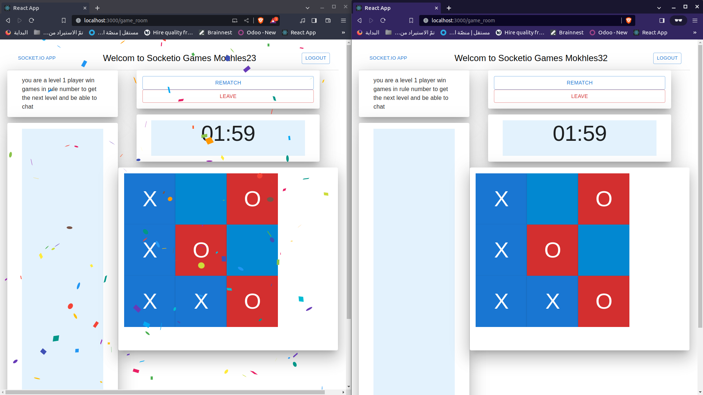

# Socket.io Demo Application

This application showcases the use of Socket.io, built using FastAPI and React. It includes three games: Chess, TicTacToe, and Rock, Paper, Scissors. The app features login and register pages, a dashboard to select live players and game types, and real-time communication for players through chat. Most of the app functionality is powered by Socket.io connections.

## Getting Started

To test this project, follow these steps:

1. **Clone the Repository:**
   ```bash
   git clone https://github.com/Mokhles-Abdelmonem/fastapi-react--socketio-mui-games.git

2. **Backend Setup:**:

- Navigate to the frontend folder.

   ```bash
   cd frontend


- create virtual environment.

   ```bash
   python3 -m venv venv

- Linux or MacOS:
   
   ```bash
   source venv/bin/activate

- Windows:
   
   ```bash
   venv\Scripts\activate

- Install required Python packages:

   ```bash
   pip install -r requirements.txt

- Run the FastAPI server:

   ```bash
   python3 main.py

3. **Frontend Setup:**:

- Navigate to the frontend folder.

   ```bash
   cd frontend

- installation
   
   ```bash   
   npm install

- start server
   
   ```bash   
   npm start


4. **Database Setup:**

- Install and configure MongoDB as the database.
- Create a new database named MokhesGame.
- (Optional) If you wish to change database names, update it in backend/database.py.


5. **Access Points:**

- Frontend UI: http://localhost:3000/
- Backend API: http://localhost:8000/
- Swagger Documentation: http://localhost:8000/docs

## Screenshots


